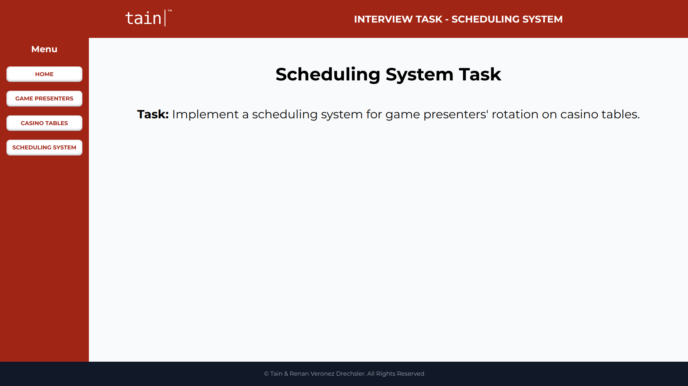
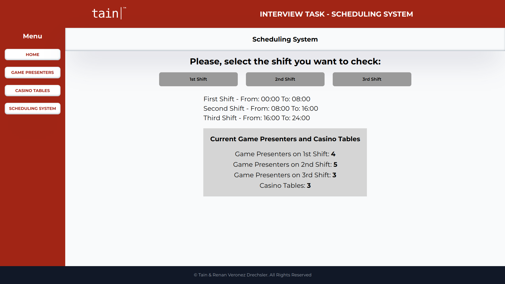
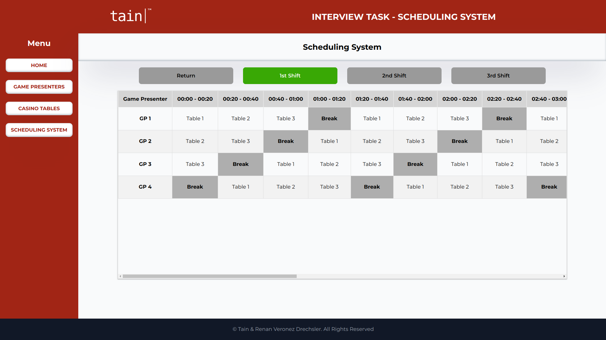
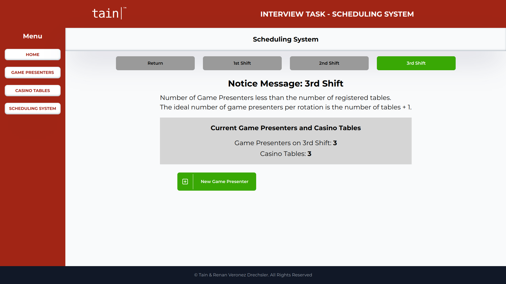

---

# Tain - Frontend Interview Test: Scheduling System

## How to Build and Run the Application

### Node Version Manager - NVM

To ensure that the development environment uses the correct version of Node.js, I recommend using Node Version Manager (NVM). For this application, NVM version 18.12.0 was used.

```bash
nvm use v18.12.0
```


### Install Node Modules Package

```bash
npm install
```

### Starting the Server

After the Node package installation is completed, run the following command to set up the server:

```bash
npm run server
```

### Starting the Development Server

Next, start the development server with the following command:

```bash
npm run dev
```

After running these commands, you can view the result in your browser by accessing:

[http://localhost:3000](http://localhost:3000)

## Introduction

In this task, you will be required to implement a scheduling system for game presenters' rotation on casino tables. An API will allow you to perform CRUD operations on two main resources:

- Game Presenters
- Tables

The Game Presenters resource represents the list of all game presenters employed by the company. Game Presenters will be split equally to fill in all three shifts within a 24-hour period (morning, afternoon, night), with each shift lasting 8 hours.

During their shift, game presenters are required to rotate between a number of casino tables and break slots, ensuring that every casino table has a game presenter at all times. A minimum of 1 break slot is to be assigned to a game presenter during an entire shift.

The time taken by a game presenter on a casino table or within a break slot must always be 20 minutes.

The rotation of game presenters depends on the headcount per shift. The ideal number of game presenters per rotation is the number of tables + 1. If there are extra game presenters than the ideal number, then extra break slots would be given.

**Task**
You are required to implement an application using React Framework that implements the following:

- [x]  List, create, view, edit and delete game presenters
- [x]  Mock the backend API and set up mock data accordingly
- [x]  Navigate between screens
- [x]  List, create, view, edit and delete tables
- [x]  Use proper validation techniques when creating and editing data
- [x]  Compute the rotation schedule of game presenters for a single day (3 shifts) and display it on screen using components of your choice.

## Solution Explanation

The design of this application was built to make all processes intuitive for the user. Considering that the application has three fundamental axes (Game Presenters, Casino Tables & Scheduling System), three screens were developed to represent each of these axes, along with an initial screen (Home) where other types of information can be added in the future.

The application follows a standard design composed of the Header, Sidebar, Maincontent, and Footer. Navigation between screens is done through the sidebar menu.

The Game Presenters and Casino Tables screens have the same design to facilitate user understanding, with the only difference being the data related to each resource. Both screens list data related to each resource and allow management through CRUD operations, which are highly intuitive.

On the Scheduling System screen, the initial rendering provides information to guide the user, buttons to display data according to each work shift, and quantitative data recorded in the system.

After the user selects one of the three possible buttons (1st Shift, 2nd Shift, 3rd Shift), the table of Game Presenters vs. Casino Tables with time slots for each Game Presenter, as well as their Break times, will be displayed. If any of the work shifts do not have the ideal number of Game Presenter vs. Casino Tables, a notification screen with appropriate guidance and an option to add a new Game Presenter will be presented.


<div align="center">
    
</div>

<div align="center">
    
</div>

<div align="center">
    
</div>

<div align="center">
    
</div>
